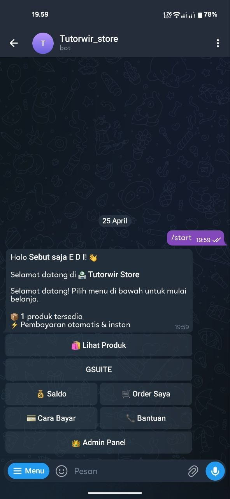
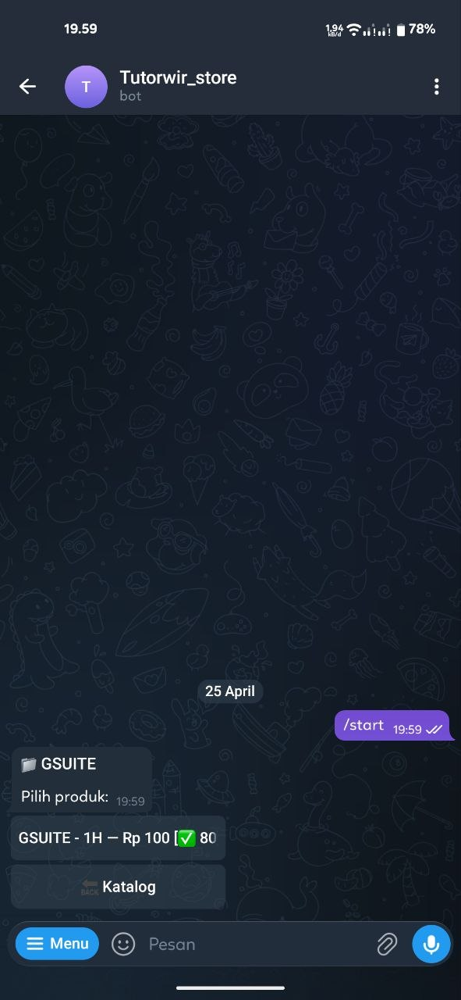
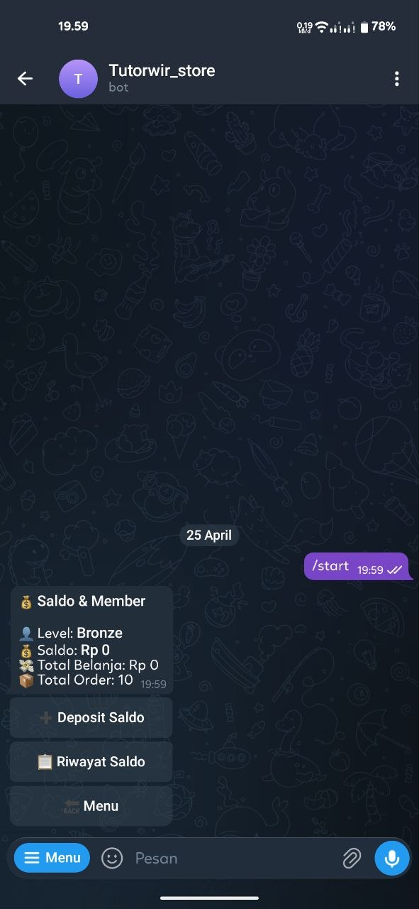
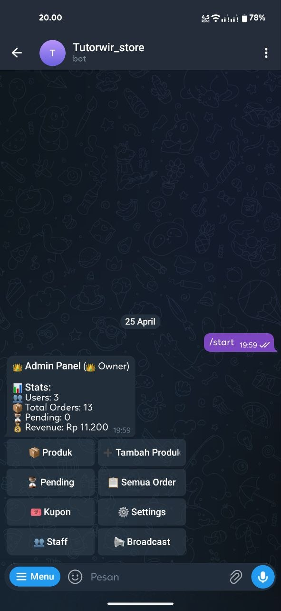
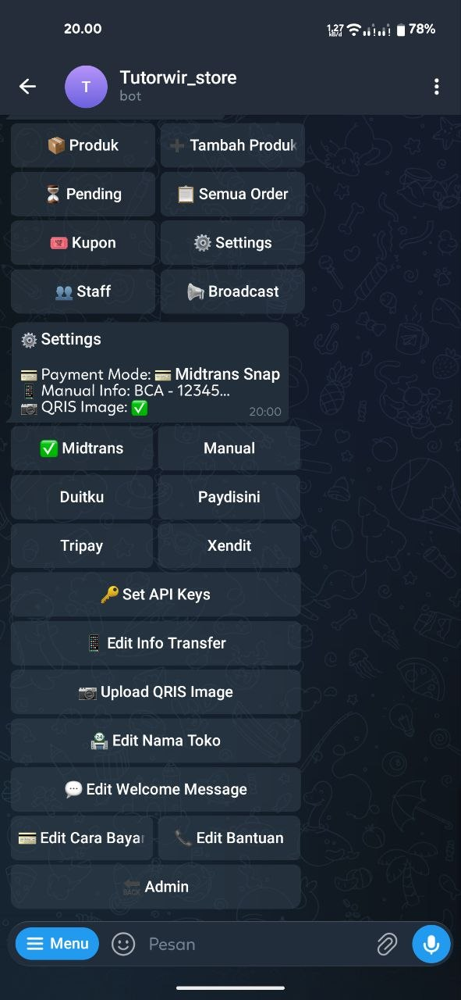
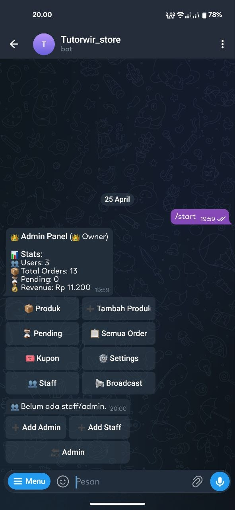

# 🏪 Telegram Store Bot

> **Bot Telegram jualan produk digital — otomatis, lengkap, dan gratis!**

[](https://nodejs.org)
[](LICENSE)
[](https://core.telegram.org/bots/api)
[](https://github.com/edikurexe/tg-store-bot)

Buat toko digital di Telegram dalam hitungan menit. Jual akun, voucher, key, config, atau produk digital apapun — pembeli bayar, produk langsung terkirim otomatis. **Tanpa coding, tanpa hosting mahal.**

---

## 📸 Screenshots

<p align="center">
  
  
  
</p>
<p align="center">
  
  
  
</p>

---

## 🔥 Kenapa Pakai Bot Ini?

| | Fitur | Keterangan |
|---|---|---|
| ⚡ | **Auto-Delivery** | Bayar → produk langsung terkirim, 24/7 tanpa admin online |
| 💳 | **6 Payment Gateway** | Midtrans, Xendit, Paydisini, Tripay, Duitku, Manual QRIS |
| 🛍️ | **Full Store System** | Kategori, stok, kupon, quantity, min/max order |
| 💰 | **Wallet & Member** | Deposit saldo, level member (Bronze → Diamond) |
| 👑 | **Admin Panel Lengkap** | Semua diatur lewat tombol — tanpa command ribet |
| 👥 | **Multi-Role** | Owner, Admin, Staff — atur tim kamu |
| 📦 | **Stock Queue** | Tiap buyer dapet item unik (akun, voucher, dll) |
| 🎟️ | **Kupon & Diskon** | Persen atau nominal, limit pemakaian |
| 📢 | **Broadcast** | Kirim promo ke semua user sekaligus |
| 🔄 | **Anti-Spam** | 1 pending order per produk, auto-cancel 30 menit |

---

## ✨ Fitur Lengkap

### 🛍️ Toko
- Katalog produk dengan kategori
- Stok numerik atau data digital (akun, key, config)
- Stock queue — setiap buyer dapat item unik
- Bulk import via file `.txt` (1000+ item sekaligus)
- Min/max order & price label per produk

### 💳 6 Payment Gateway

| Gateway | Tipe | QRIS di Chat | Biaya |
|---------|------|:---:|---|
| **Midtrans** | Snap (redirect) | ❌ | Varies |
| **Xendit** | QRIS direct | ✅ | 0.7% |
| **Paydisini** | QRIS direct | ✅ | 0.7% |
| **Tripay** | QRIS direct | ✅ | Varies |
| **Duitku** | Redirect | ❌ | Varies |
| **Manual** | Static QRIS/Transfer | ✅ | Free |

> 💡 Ganti payment gateway kapan aja dari Admin Panel — tanpa ubah kode!

### ⚡ Auto-Delivery
- Buyer bayar → produk langsung terkirim otomatis
- Support: akun, voucher, key, config, link, apapun
- Opsi manual delivery untuk produk non-digital

### 💰 Wallet & Member System
- Deposit saldo via payment gateway apapun
- Bayar pakai saldo (instan, tanpa redirect)
- Riwayat transaksi lengkap
- Level member otomatis:

| Level | Min. Belanja |
|-------|-------------|
| 🥉 Bronze | Rp 0 |
| 🥈 Silver | Rp 200.000 |
| 🥇 Gold | Rp 500.000 |
| 💎 Diamond | Rp 1.000.000 |

### 🎟️ Kupon & Diskon
- Diskon persen atau nominal
- Limit pemakaian & expired date
- Toggle on/off dari admin

### 👑 Admin Panel
- **Full inline buttons** — semua diatur lewat tombol
- Tambah/edit/hapus produk
- Approve/reject order manual
- Broadcast ke semua user
- Statistik penjualan & revenue
- Settings lengkap (payment, nama toko, welcome message, dll)

### 👥 Multi-Role System

| Role | Akses |
|------|-------|
| 👑 Owner | Full access + settings + staff management |
| 🔑 Admin | Produk, kupon, broadcast, order |
| 👷 Staff | Stok, approve order |

### 🛡️ Fitur Lainnya
- ⏰ Auto-cancel order expired (30 menit)
- ✅ Konfirmasi sebelum beli
- 📏 Quantity order (min/max)
- 🔄 Anti-spam (1 pending order per produk)
- 📊 Dashboard statistik
- ⚙️ Semua settings bisa diedit dari bot
- 📝 Edit message navigation (chat tetap bersih)

---

## 🚀 Quick Start

### Prerequisites
- Node.js 18+
- Telegram Bot Token (dari [@BotFather](https://t.me/BotFather))

### Instalasi

```bash
# Clone repo
git clone https://github.com/edikurexe/tg-store-bot.git
cd tg-store-bot

# Install dependencies
npm install

# Jalankan
TG_STORE_TOKEN=your_token ADMIN_IDS=your_user_id node bot.js
```

### 🐳 Docker (Recommended)

```bash
git clone https://github.com/edikurexe/tg-store-bot.git
cd tg-store-bot

# Setup environment
cp .env.example .env
nano .env  # Isi bot token & admin ID

# Run
docker compose up -d

# Lihat logs
docker compose logs -f
```

### Environment Variables

| Variable | Required | Keterangan |
|----------|:---:|-------------|
| `TG_STORE_TOKEN` | ✅ | Telegram Bot Token |
| `ADMIN_IDS` | ✅ | Owner Telegram User ID (comma separated) |
| `STORE_NAME` | ❌ | Nama toko (default: 🏪 Digital Store) |
| `MIDTRANS_SERVER_KEY` | ❌ | Midtrans Server Key |
| `MIDTRANS_PRODUCTION` | ❌ | `true` = production, `false` = sandbox |

> 🔑 API key payment gateway lainnya bisa diset dari Admin Panel → ⚙️ Settings → 🔑 API Keys

### Systemd Service

```bash
cat > ~/.config/systemd/user/tg-store-bot.service << 'EOF'
[Unit]
Description=Telegram Store Bot
After=network.target

[Service]
Type=simple
WorkingDirectory=/path/to/tg-store-bot
ExecStart=/usr/bin/node bot.js
Restart=on-failure
RestartSec=10
Environment=TG_STORE_TOKEN=your_token
Environment=ADMIN_IDS=your_user_id

[Install]
WantedBy=default.target
EOF

systemctl --user daemon-reload
systemctl --user enable --now tg-store-bot
```

---

## 📖 Cara Pakai

### Untuk Pembeli
1. Buka bot → `/start`
2. Pilih kategori & produk
3. Pilih jumlah → konfirmasi
4. Pakai kupon (opsional)
5. Bayar via QRIS/gateway/saldo
6. Produk langsung terkirim! ✅

### Untuk Admin
1. Tekan 👑 Admin Panel
2. Tambah produk → isi stok
3. Atur payment gateway di ⚙️ Settings
4. Kelola kupon, staff, dan order

### Format Stok Digital

```
# Satu baris per item (pisah Enter)
user1@mail.com:pass1
user2@mail.com:pass2

# Multi-baris per item (pisah ===)
server: sg1.vpn.com
user: abc
pass: 123
===
server: sg2.vpn.com
user: def
pass: 456
```

---

## 🔧 Setup Payment Gateway

<details>
<summary><b>Midtrans</b></summary>

1. Daftar di [midtrans.com](https://midtrans.com)
2. Ambil Server Key dari Dashboard → Settings → Access Keys
3. Set di bot: Admin → ⚙️ Settings → 🔑 API Keys
</details>

<details>
<summary><b>Xendit</b></summary>

1. Daftar di [xendit.co](https://xendit.co)
2. Ambil Secret Key dari Dashboard → Settings → API Keys
3. Set di bot: Admin → ⚙️ Settings → 🔑 API Keys
</details>

<details>
<summary><b>Paydisini</b></summary>

1. Daftar di [paydisini.co.id](https://paydisini.co.id)
2. Ambil API Key dari Dashboard
3. Set di bot: Admin → ⚙️ Settings → 🔑 API Keys
</details>

<details>
<summary><b>Tripay</b></summary>

1. Daftar di [tripay.co.id](https://tripay.co.id)
2. Ambil API Key dan Merchant Code
3. Set di bot: Admin → ⚙️ Settings → 🔑 API Keys
</details>

<details>
<summary><b>Duitku</b></summary>

1. Daftar di [duitku.com](https://duitku.com)
2. Ambil Merchant Code dan API Key
3. Set di bot: Admin → ⚙️ Settings → 🔑 API Keys
</details>

<details>
<summary><b>Manual (Tanpa Gateway)</b></summary>

1. Admin → ⚙️ Settings → Pilih "Manual"
2. Upload gambar QRIS
3. Set info transfer
</details>

---

## 📁 Struktur Project

```
tg-store-bot/
├── bot.js              # Main bot (single file, ~2500 lines)
├── store.db            # SQLite database (auto-created)
├── screenshots/        # Screenshot fitur
├── package.json
├── docker-compose.yml
├── Dockerfile
├── .env.example
├── .gitignore
├── LICENSE
└── README.md
```

## 🗄️ Database

| Tabel | Keterangan |
|-------|------------|
| `products` | Katalog produk |
| `orders` | Riwayat order |
| `users` | Profil user & saldo |
| `stock_items` | Stok digital (queue) |
| `coupons` | Kupon diskon |
| `settings` | Konfigurasi bot |
| `staff` | Role admin & staff |
| `wallet_tx` | Transaksi wallet |

---

## 🤝 Contributing

Contributions welcome! Silakan:
- 🐛 Report bugs
- 💡 Suggest features
- 🔧 Submit pull requests

## 📄 License

MIT License — lihat [LICENSE](LICENSE)

## 👨‍💻 Author

**edikurexe** — [GitHub](https://github.com/edikurexe) · [Telegram](https://t.me/TutorWir)

---

<p align="center">
  ⭐ Kalau berguna, kasih star ya!
</p>
